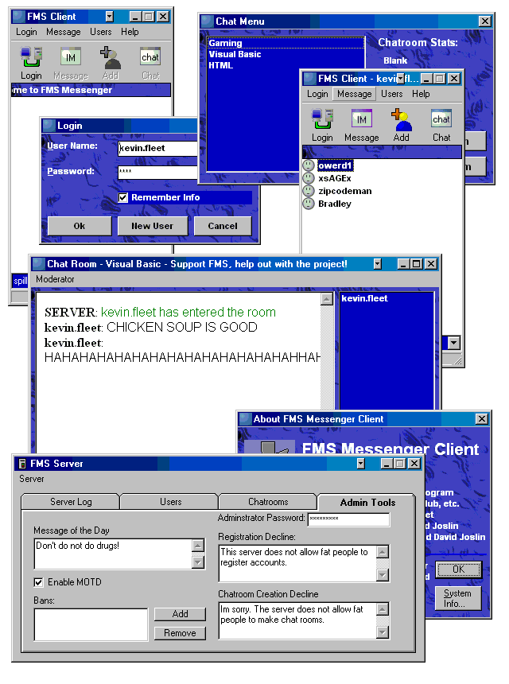

<div align="center">

## FMS Instant Messenger


</div>

### Description

This is a pretty much a fully fledged instant messenger (without encryption, oh well). It has the works, multiple chat rooms, instant messaging, avatars, and even some stuff i might have forgotten about. I just dug this project back up in hopes to maybe spark some interest in it. Some things may be unfinished and please let me know of any changes you think i could make to make it better. Any help is welcome. Enjoy.
 
### More Info
 


<span>             |<span>
---                |---
**Submitted On**   |
**By**             |[poop\_4\_brains](https://github.com/Planet-Source-Code/PSCIndex/blob/master/ByAuthor/poop-4-brains.md)
**Level**          |Intermediate
**User Rating**    |5.0 (20 globes from 4 users)
**Compatibility**  |VB 6\.0
**Category**       |[Internet/ HTML](https://github.com/Planet-Source-Code/PSCIndex/blob/master/ByCategory/internet-html__1-34.md)
**World**          |[Visual Basic](https://github.com/Planet-Source-Code/PSCIndex/blob/master/ByWorld/visual-basic.md)
**Archive File**   |[](https://github.com/Planet-Source-Code/poop-4-brains-fms-instant-messenger__1-55474/archive/master.zip)


### Source Code

```
Due to issues with uploading,
I had to upload it here:
http://kevgames.hostkingdom.net/fmspsc.zip
```

